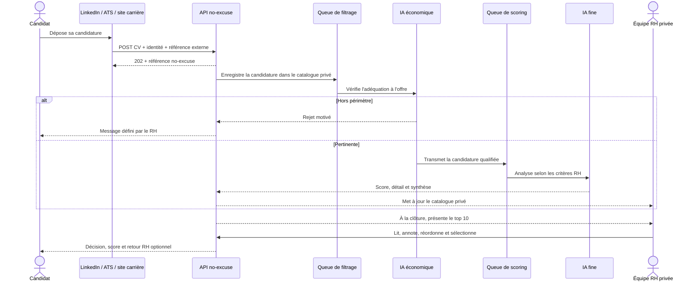

# no-excuse

[English](README.en.md) · Français



SaaS open source de traitement responsable des candidatures. Une entreprise installe sa propre instance, ses RH partagent les annonces et leur suivi, puis LinkedIn, un ATS ou un site carrière transmet chaque CV à une API d’ingestion dédiée. no-excuse écarte d’abord le hors-périmètre avec une réponse expliquée, puis analyse les profils pertinents, calcule un score de correspondance détaillé selon les critères RH et prépare un top 10 pour la décision humaine finale. Les offres et leur catalogue ne sont jamais publics.

## Ce que fait le MVP

- espace d’entreprise partagé, équipe RH avec rôles et accès privé par jeton Sanctum ;
- parcours simple en trois étapes : installation, configuration, première annonce ;
- clé Bearer distincte et révocable pour chaque offre, affichée une seule fois ;
- ingestion multipart compatible avec tout connecteur HTTP et déduplication par source/référence externe ;
- première file avec un modèle économique pour écarter le hors-périmètre ;
- seconde file avec un modèle plus fin pour produire score, critères et synthèse ;
- traitement jusqu’à une date de clôture, puis top 10 réordonnable ;
- lecture des CV historisée, annotations internes et retour candidat optionnel ;
- sélection humaine finale et notification de tous les autres candidats ;
- choix indépendant du fournisseur et du modèle pour les deux étapes IA ;
- prompts de filtrage et de scoring préremplis, puis modifiables par l’entreprise ;
- concurrence de 1 à 10 workers par étape, ajustée automatiquement à chaud.
- purge du fichier CV après notification d’un rejet, avec conservation de la trace d’audit ;
- lecteur PDF intégré MIT, sans onglet `blob:` ;
- démo à capacité bornée avec liste d’attente e-mail opt-in.

## Stack actuelle

- PHP 8.5.8 et Laravel 13.20 ;
- Vue 3.5, TypeScript 6, Vite 8, Pinia, Vue Router et vue-i18n ;
- PostgreSQL 18.4 et Redis 8.2 ;
- Laravel AI SDK, PDF Parser et Laravel Sanctum ;
- Docker Compose, Make et GitHub Actions.

## Démarrage

Prérequis : Docker, Docker Compose et Make. Aucun runtime PHP ou Node n’est nécessaire sur l’hôte.

```bash
make setup
```

Puis ouvrir :

- interface : http://localhost:5173 ;
- API : http://localhost:18080/api.

Au premier accès, l’assistant demande seulement le nom de l’entreprise et le compte responsable. L’écran suivant regroupe les e-mails, les IA, la vélocité, les prompts et l’équipe. Le troisième permet de créer la première annonce.

Sur `no-excuse.pro`, **Tester la démo** crée automatiquement un espace RH temporaire : aucun identifiant n’est demandé. La sandbox donne aussi accès à la configuration détaillée du backoffice en lecture seule ; les réglages et la gestion d’équipe restent verrouillés. Le formulaire de connexion est réservé aux installations d’entreprise et n’est pas présenté comme parcours principal sur le domaine public.

Pour charger des données de démonstration sur une instance vide :

```bash
make demo
```

Compte de démonstration : `demo@no-excuse.test` / `demo-password-2026`.

La campagne de démonstration doit recevoir une nouvelle clé depuis son écran d’intégration avant le premier envoi. La clé précédente est révoquée à chaque rotation.

## Brancher LinkedIn, un ATS ou un site carrière

Chaque offre affiche une URL de la forme :

```text
POST /api/v1/intake/{offer_uuid}/applications
Authorization: Bearer {one_time_ingestion_key}
```

Le service source envoie un formulaire multipart avec `source`, `external_reference`, `candidate_name`, `candidate_email`, `cv` et éventuellement `cover_letter`. Consultez le [guide LinkedIn](docs/linkedin.md), le [guide d’intégration](docs/integration-api.md) et le [contrat OpenAPI](docs/openapi.yaml).

> LinkedIn ne propose pas un webhook universel ouvert pour toutes les candidatures. La compatibilité repose sur ce contrat générique : un connecteur LinkedIn autorisé, un ATS partenaire ou une automatisation côté site carrière traduit l’événement vers l’API no-excuse.

## Fournisseurs IA

Le mode `demo` est actif par défaut : il est local, gratuit, déterministe et ne transmet aucun CV. Le mode `live` s’active avec `NO_EXCUSE_AI_MODE=live` et la clé du fournisseur concerné.

Les tokens ne sont jamais saisis dans l’interface RH. Le développeur les place dans `api/.env` pour une installation locale, ou dans le gestionnaire de secrets de l’infrastructure en production (Docker Secrets, Vault ou équivalent). Le fichier `.env` est ignoré par Git. L’écran **Configuration** ne reçoit que deux booléens par fournisseur — utilisable et clé configurée — et n’expose jamais la clé, même masquée. Par exemple :

```dotenv
NO_EXCUSE_AI_MODE=live
OPENAI_API_KEY=change-me-outside-git
ANTHROPIC_API_KEY=change-me-outside-git
```

Après une modification des secrets, rechargez les services avec `make restart`. En production, limitez la lecture des secrets au processus applicatif et effectuez leur rotation selon la politique de l’entreprise.

Fournisseurs sélectionnables : OpenAI / ChatGPT, Anthropic / Claude, Google Gemini, Mistral, Groq, DeepSeek, OpenRouter, Ollama et toute API compatible OpenAI. Le modèle reste librement éditable par le RH afin d’éviter d’enfermer le produit dans un catalogue vite obsolète.

La configuration de l’entreprise contient deux prompts de base responsables : l’un décide si une candidature mérite l’analyse approfondie, l’autre impose une comparaison factuelle et expliquée pour le scoring. Ils peuvent être adaptés aux règles de recrutement de l’entreprise.

Les valeurs « filtrages simultanés » et « analyses simultanées » pilotent de vrais processus de queue. Les superviseurs applicatifs ajoutent ou retirent les workers non-root environ cinq secondes après l’enregistrement, sans exposer le socket Docker à l’application.

## Démo publique sans coût IA

Le mode public optionnel crée une sandbox logique dédiée à chaque visiteur. Elle contient une entreprise temporaire, un compte RH et 20 CV entièrement fictifs. Les vraies queues filtrent et scorent progressivement les candidatures avec l’analyseur déterministe local ; le visiteur peut ensuite produire le top 10, lire les CV, annoter, réordonner et sélectionner.

La démo publique n’accepte aucun CV externe, n’appelle aucun fournisseur payant et ne transmet aucun e-mail candidat. Chaque réponse générée peut néanmoins être prévisualisée dans l’espace RH : c’est le véritable rendu HTML du mail de production, affiché dans une iframe isolée. Chaque sandbox possède son propre UUID d’organisation et ses propres jetons Sanctum. Elle est supprimée avec ses fichiers après quatre heures par défaut ou immédiatement lorsque le visiteur choisit de la libérer et se déconnecte. Cinq sandboxes simultanées sont autorisées au maximum et un même visiteur ne peut en créer qu’une pendant cette durée ; une liste d’attente opt-in peut envoyer un unique e-mail de disponibilité.

Le développement indépendant de no-excuse et de [Sonomundi](https://sonomundi.com) peut être soutenu sur [Ko-fi](https://ko-fi.com/axxon).

Le déploiement VPS dédié utilise `compose.demo.yml` : PostgreSQL, Redis, l’API et les workers ne publient aucun port. Seul le proxy web écoute sur `DEMO_HTTP_PORT`. Consultez [le guide de déploiement de la démo](docs/public-demo-deployment.md).

## Validation

```bash
make validate
```

Les tests backend s’exécutent dans un projet Docker isolé avec SQLite en mémoire. Le lint vérifie Laravel Pint puis le typage et le build de l’interface.

## Principes de sécurité et d’équité

- aucune route publique ne liste ou ne révèle une offre ou une candidature ;
- les clés d’ingestion et de connexion sont stockées sous forme de hash ;
- les CV ne sont servis qu’aux membres de l’entreprise concernée ;
- les consignes IA excluent les informations sensibles et critères discriminatoires ;
- le score assiste la décision, mais la sélection finale reste humaine ;
- en mode `live`, le texte du CV quitte l’infrastructure vers les fournisseurs choisis : un accord de traitement des données et une politique de rétention restent indispensables avant production.

Voir aussi [SECURITY.md](SECURITY.md) et [CONTRIBUTING.md](CONTRIBUTING.md).

Guides : [e-mail](docs/email.md) · [rétention](docs/data-retention.md) · [démo publique](docs/public-demo-deployment.md) · [licence et mentions](docs/legal.md).

## Licence

MIT
